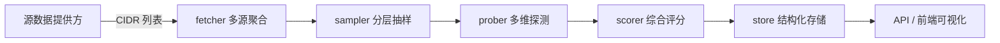

# 架构与原理总览

本文全面剖析 **cf-edgescout** 的工作原理，帮助你快速理解系统在“官方 + 第三方”双路数据源下的探测优选流程。

## 总体流程

1. **数据采集（fetcher）**：并行抓取 Cloudflare 官方与第三方（BestIP、UOUIN 等）提供的 CIDR 网段，支持纯文本 / JSON 两类格式解析，并自动去重、记录权重。
2. **抽样调度（sampler + scheduler）**：按照来源权重和网段容量进行分层抽样，生成待测候选；调度器负责节流、重试与任务生命周期管理。
3. **网络探测（prober）**：针对单个 IP 节点执行 TCP/TLS/HTTP 测量，采集 ALPN、TLS 证书指纹、CF-RAY/Colo、吞吐等多维指标，同时计算响应体哈希、校验证书与 SNI 匹配。
4. **评分决策（scorer）**：将延迟、成功率、吞吐、链路完整性与来源偏好综合为 0~1 区间得分，支持按来源设定权重与偏置。
5. **结果存储与分发（store + API + 前端）**：以 JSONL/内存形式持久化记录，HTTP API 提供汇总、趋势与分页查询；React + Vite 前端展示多维榜单、趋势曲线与筛选控制台。

## 关键模块说明

### fetcher：多源聚合器

- `ProviderSpec` 描述单个提供方（名称、类型、权重、数据格式）。
- `EndpointSpec` 支持 `plain_cidr`（逐行 CIDR）与 `json_array`（指定 JSON 路径）两种解析模式。
- `FetchAll` 会在单次请求中完成全部提供方抓取，并在部分失败时返回可用结果同时附带错误提示。

### sampler：分层抽样器

- `SampleSources` 会根据提供方权重、网段大小生成候选，候选对象带有来源、提供方、网络家族等元信息。
- 历史去重机制防止短时间内重复探测同一 IP。

### prober：多维探测器

- 利用 Go 原生 `net`/`crypto/tls`，逐步完成 TCP、TLS、HTTP 三阶段测速。
- 额外采集证书 CN/SAN、SNI 匹配状态、HTTP 状态码、响应体 SHA-256 等安全与质量指标。
- 基于 `CF-RAY` 解析 colo，并通过 `geo.LookupColo` 补充城市/国家信息。

### scorer：综合评分器

- 默认权重：延迟 0.35、成功率 0.25、吞吐 0.2、完整性 0.2。
- `SourcePreference` 可对特定来源或提供方加权，例如默认对官方源做轻微提升。
- 返回结果保留每个维度的归一化得分与最终得分。

### store / API / 前端

- `store.JSONL` 与 `store.Memory` 提供持久化与内存缓存两套实现。
- API 现包含 `/api/results`（分页 + 筛选）、`/api/results/summary`（提供方统计）、`/api/results/timeseries`（分时趋势）三个核心端点。
- 前端以 React 18 + Vite + Tailwind + Recharts 构建，配合 React Query 完成数据缓存与刷新，提供筛选、统计卡片、趋势图与表格视图。

## 数据模型扩展

| 字段 | 说明 |
| --- | --- |
| `Measurement.Source` | 数据源唯一键，用于追踪来源偏好与过滤。 |
| `Measurement.Provider` | 可读提供方名称，便于前端展示。 |
| `Measurement.SourceWeight` | 采样阶段注入的权重，评分阶段会乘以该值。 |
| `Measurement.Integrity` | 记录 TLS 证书信息、HTTP 状态、响应哈希等链路完整性指标。 |
| `Measurement.Location` | 通过 CF colo 映射得到的地理信息。 |

## 扩展思路

- **新增提供方**：在配置文件或 CLI 传参中追加 `ProviderSpec`，支持 JSON/文本格式扩展。
- **评分因子调整**：根据业务场景修改 `scorer.Config` 权重或 `SourcePreference`，对第三方源进行奖励或惩罚。
- **可视化增强**：可进一步叠加地图、热力图或导出功能，接入告警系统进行实时通知。

更多实践指南请参考 [部署与运维手册](./deployment.md)。
